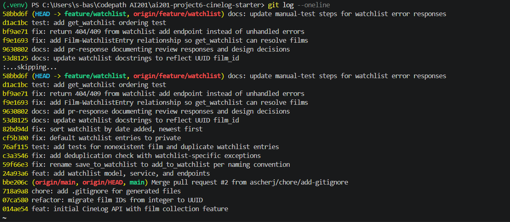

# PR Response Doc — CineLog Watchlist Feature

## AI Usage
I used AI (Claude Code) throughout this project as a coding assistant, reviewer, and reasoning partner. It helped with drafting and structure for this response doc, and with figuring out where and how to change the code to address the dev lead's comments. More specifically, by milestone:

- **Understanding the codebase (Milestone 1):** I asked AI to summarize `models.py`, `services/collection_service.py`, and the `add_to_collection()` function — what each is responsible for, how the deduplication check works, and what it returns when a film isn't found — so I understood the existing patterns before writing my own code.

- **Code changes (Milestone 2):** I wrote the deduplication logic in `add_to_watchlist()` myself, applying the pattern I'd learned from `add_to_collection()` (I did not have AI write the dedup code). I used AI to verify my rename/dedup/test changes were complete (e.g. confirming zero remaining `save_to_watchlist` references), to generate a duplicate-case test (`test_add_to_watchlist_duplicate_raises`) modeled on the existing collection test, and to fix a stale docstring.

- **Design responses (Milestone 3):** AI helped me draft and structure my written responses for Comments 4 (default visibility) and 5 (sort order). I then had it act as a devil's advocate on those drafts — I asked what counterargument a careful reviewer would raise and what tradeoff I wasn't acknowledging. What it surfaced: that defaulting to *private* is itself an unconfirmed product assumption (and that the `public` field has no UI to toggle it), and that date-added sorting hurts lookup on long watchlists and buries an older backlog. I incorporated all of these: I kept my original decisions (private default, date-added sort) but revised both write-ups to acknowledge these tradeoffs directly — for Comment 4, that private is itself a product call I should flag to PM and that there's no toggle UI yet; for Comment 5, that alphabetical helps lookup and oldest-first surfaces the backlog, and that user-selectable sort is the real long-term answer with date-added as the sensible default. The counterargument about over-stating "sensitivity" also led me to re-ground Comment 4 on asymmetry-of-harm instead. The decisions and the reasoning are mine; AI was the stress-test, not the author of the conclusions.

- **Rebase (Milestone 3):** I used AI to perform the rebase of `feature/watchlist` onto `main`, resolve the `.gitignore` (union) and `models.py` (UUID) conflicts, and confirm no merge commits or conflict markers remained. A `backup/watchlist-pre-rebase` branch was created first so the rebase was reversible.

## Comment 1 — Rename
**What I did:** Renamed `save_to_watchlist()` to `add_to_watchlist()` in `services/watchlist_service.py` to match the project's `verb_to_noun` convention (consistent with `add_to_collection()`). To find every call site I ran a project-wide search for the old symbol `save_to_watchlist`, which turned up 3 occurrences across 2 files: the function definition in `services/watchlist_service.py`, and both the import and the call site in `routes/watchlist/watchlist.py`. I updated all three.
**How I verified:** Re-ran the project-wide search for `save_to_watchlist` and confirmed 0 remaining occurrences, then ran `pytest tests/ -v` (all tests pass). Committed on its own (`fix: rename save_to_watchlist to add_to_watchlist per naming convention`).

## Comment 2 — Deduplication
**What I did:** Added a duplicate check to `add_to_watchlist()` modeled on `add_to_collection()` in `services/collection_service.py`. Before creating the entry, it queries `WatchlistEntry.query.filter_by(user_id=..., film_id=...).first()`; if a matching entry already exists it raises an error instead of inserting a duplicate row. Rather than reuse the collection's exception, I defined watchlist-specific exceptions (`AlreadyInWatchlistError`, plus `FilmNotFoundError` and `NotInWatchlistError`) in `services/watchlist_service.py` so the error type and message describe the watchlist accurately. Note: `WatchlistEntry` has no unique DB constraint, so this service-level check is what prevents duplicates.
**How I verified:** Confirmed the pattern matches `add_to_collection()` (same filter_by/first/raise-before-insert flow), then added a dedicated test, `test_add_to_watchlist_duplicate_raises` (mirroring the collection duplicate test), which adds the same film twice, asserts `AlreadyInWatchlistError` is raised on the second call, and confirms only one entry exists in the DB. `pytest tests/ -v` passes (6 tests). Committed separately (`fix: add deduplication check with watchlist-specific exceptions`).

## Comment 3 — Missing test
**What I did:** Created `tests/test_watchlist.py` and wrote `test_add_to_watchlist_nonexistent_film_raises`, using `test_add_to_collection_nonexistent_film_raises` in `tests/test_collection.py` as my template. I copied the same `app`, `sample_user`, and `sample_film` fixtures and the same `pytest.raises(FilmNotFoundError)` assertion structure, pointing it at `add_to_watchlist()` with a nonexistent `film_id`.
**How I verified:** Ran `pytest tests/test_watchlist.py -v` (passes) and `pytest tests/ -v` (all pass, nothing broken). The test lives in its own commit (`test: add tests for nonexistent film and duplicate watchlist entries`).

## Comment 4 — Default visibility
**My position:** Watchlists should default to **private** (`public=False`). I changed the default in the `WatchlistEntry` model in `models.py`.
**Reasoning:** I'm not defaulting to private because I think a watchlist is especially sensitive; for a film app, "movies I want to watch" is pretty low-stakes. My real reason is that the two ways this can go wrong aren't equal. If it defaults to private and someone wanted it public, they flip one setting and they're done. If it defaults to public and someone didn't realize it, their activity is already out there and they can't take it back. When one mistake is a quick fix and the other is permanent, I'd rather lean toward the one you can undo. Private also matches what people generally expect: nothing about you shows up publicly until you choose to share it.
**Tradeoff acknowledged:** I'll be honest about the downsides. The obvious one is that defaulting to private makes the feature less social out of the gate. If the point of watchlists is partly to let people see what their friends plan to watch, then private-by-default works against that, and anyone who wants to share has to go turn it on. The sharper problem is that picking "private" is itself a product assumption, which is really the same thing the reviewer flagged about `public=True` — I'd just be guessing in the other direction. Honestly this is a call product should make, not one I should quietly settle in a model default. And there's no UI to toggle visibility yet, so for now "private by default" just means "not shared at all" until someone builds that. So I'd keep private as the default for the moment because it's the safe, reversible choice while the product direction and the sharing UI are still open, but I'd raise it with product instead of treating it as decided.

## Comment 5 — Sort order
**My position:** Sort `get_watchlist()` by **`date_added` descending (newest first)**. I changed the query in `services/watchlist_service.py` from `.join(Film).order_by(Film.title.asc())` to `.order_by(WatchlistEntry.date_added.desc())`.
**Reasoning:** When someone opens their watchlist, I think they mostly want to see what they just added, not scroll through an alphabetical list. Newest-first fits how a "save it for later" list actually gets used. It also matches `get_collection()`, which already sorts newest-first, so the two behave the same way instead of surprising people. I dropped the `.join(Film)` because the sort no longer needs anything from the Film table; `entry.film` still works through the relationship when I build each result.
**Engagement with reviewer's point:** I agree with going date-added, and I'd add that it also fixes an inconsistency with `get_collection()` rather than just doing what was asked. But I don't want to pretend date-added is perfect. A watchlist isn't really the same thing as a collection: a collection is a record of what you've already watched, where recency makes sense, but a watchlist is a to-do list you pick from. For that, other orderings genuinely have a point. Alphabetical is better when you're checking "did I already save Dune?" on a long list, and oldest-first would actually resurface the stuff you've been meaning to watch forever, which newest-first tends to bury. So my honest take is that date-added is the right default because it matches the most common thing people do, but the real answer down the line is letting users choose the sort (date-added by default, with alphabetical, oldest, or rating as options). I'd ship date-added now and log user-selectable sort as a follow-up.

## Comment 6 — Rebase
**What conflicted:** Rebasing `feature/watchlist` onto `main` produced two conflicts. (1) `.gitignore` — both branches independently added one (add/add). (2) `models.py` — `main`'s UUID refactor changed `Film.id` and `CollectionEntry.film_id` from `Integer` to `String(36)` UUID and removed the `WatchlistEntry` class entirely, while my branch still defined `WatchlistEntry` with an `Integer` `film_id`.
**How I resolved it:** For `.gitignore`, I took the union of both sides (kept `.pytest_cache/`, `.venv/`, `venv/`). For `models.py`, I kept `main`'s UUID versions of `Film` and `CollectionEntry` and re-added the `WatchlistEntry` class with `film_id = db.Column(db.String(36), db.ForeignKey("film.id"))` (UUID, matching the refactor). I also updated the now-stale docstrings that described `film_id` as an integer (`services/watchlist_service.py` and `routes/watchlist/watchlist.py`) to say UUID. Before starting I created a `backup/watchlist-pre-rebase` branch so the rebase was fully reversible. After the rebase, my first resolution had accidentally folded the whole `WatchlistEntry` re-add into the Comment 4 commit; I cleaned that up so the UUID model re-add now lives in the original "added watchlist model" commit and the Comment 4 commit is a clean one-line default change (verified the final tree was byte-identical before and after the cleanup).
**How I verified no conflict remains:** `git status` shows a clean tree with no rebase in progress; `pytest tests/ -v` passes all 6 tests on the new base; and `git grep Integer -- models.py` shows only `year` and `rating` (both legitimately integers) — no integer `film_id` remains anywhere in the watchlist code.

## Commit History
After addressing all six review comments, I rewrote the branch history so each commit is a single logical change with a conventional-commit message and there are no merge commits. A later end-to-end check surfaced two bugs (unhandled endpoint errors and a missing `Film`–`WatchlistEntry` relationship), which I fixed in the four follow-up commits at the top:

```
docs: update manual-test steps for watchlist error responses
test: add get_watchlist ordering test
fix: return 404/409 from watchlist add endpoint instead of unhandled errors
fix: add Film-WatchlistEntry relationship so get_watchlist can resolve films
docs: add pr-response documenting review responses and design decisions
docs: update watchlist docstrings to reflect UUID film_id
fix: sort watchlist by date added, newest first
fix: default watchlist entries to private
test: add tests for nonexistent film and duplicate watchlist entries
fix: add deduplication check with watchlist-specific exceptions
fix: rename save_to_watchlist to add_to_watchlist per naming convention
feat: add watchlist model, service, and endpoints
```


## PR Description

**What the feature does**
Adds a **watchlist** to CineLog so a user can save films they intend to watch (distinct from their collection of films already watched). The feature provides:
- `POST /watchlist/<user_id>/add` — add a film to the user's watchlist (body: `{ "film_id": "<uuid>" }`).
- `GET /watchlist/<user_id>` — return the user's watchlist.
- A `WatchlistEntry` model, service-layer logic (`add_to_watchlist`, `get_watchlist`) with duplicate prevention and a not-found guard, and REST endpoints.

**Design decisions**
1. **Default visibility → private (`public=False`).** New watchlist entries are private by default; sharing is an explicit opt-in. Rationale (see Comment 4): the harm is asymmetric — a private-by-default entry the user wanted public is a one-click fix, whereas a public-by-default entry they didn't expect can't be un-exposed after the fact.
2. **Sort order → date added, newest first (`date_added` descending).** `get_watchlist()` returns the most recently added films first, matching `get_collection()`'s behavior. Rationale (see Comment 5): recency matches the most common interaction; user-selectable sort is noted as the future direction.

**How to manually test**
1. Set up: `pip install -r requirements.txt`, then run the app (`python app.py`) or open a shell with an app context. You'll need an existing `user_id` and a `film_id` (both UUIDs) in the database.
2. **Add to watchlist:** `POST /watchlist/<user_id>/add` with JSON body `{ "film_id": "<existing-film-uuid>" }` → expect `201` and the created entry (note `"public": false`).
3. **View watchlist:** `GET /watchlist/<user_id>` → expect a JSON list, newest-added film first.
4. **Duplicate guard:** repeat step 2 with the same film → expect `409 Conflict` with an error message (not a second row); confirm only one entry exists.
5. **Missing film:** `POST` with a `film_id` that doesn't exist → expect `404 Not Found` with an error message, not a raw 500 / database error.
6. **Automated:** `pytest tests/ -v` → all tests pass (includes nonexistent-film and duplicate-entry cases for the watchlist).
